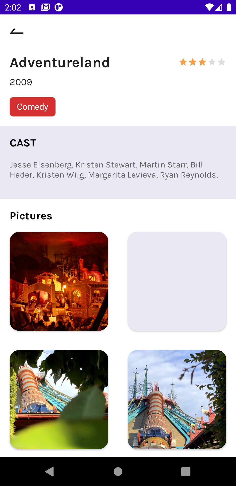
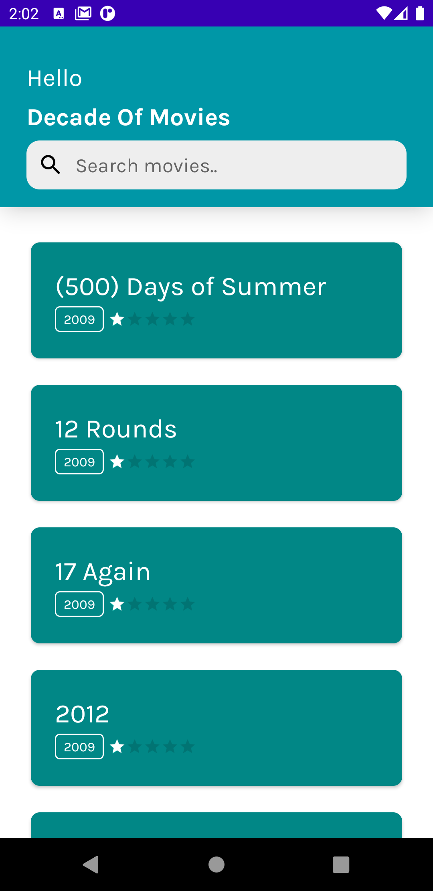

# Decade of Movies App

  
  
   

Demo Application for movies of last decades.

## Build Instructions ##

The [gradle build system](http://tools.android.com/tech-docs/new-build-system/user-guide) will fetch all dependencies and generate
files you need to build the project. After this select device and run it.

You can use Android Studio to run and test the app
s
